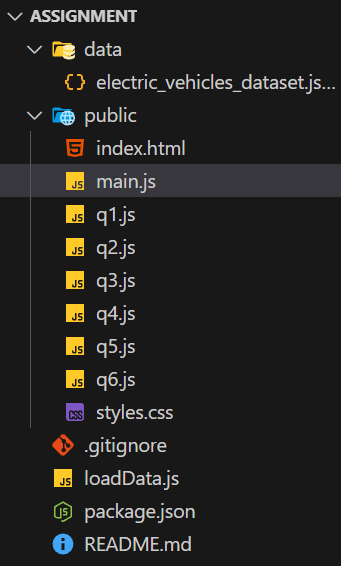

# APLC Assignment Phase 1 (Imperative Programming)

The assignment involves working with a JSON file containing 3022 records of electronic vehicles and plug-in models across many brands and years, capturing technical specifications, performance, pricing, manufacturing origin, sales, and safety-related attributes.

## Questions

Phase 1 require to use imperative programming approach to perform the following operations:

1. Display the total number of vehicles produced by each manufacturing company.
2. Search and display the list of models available from a specific manufacturing company.
3. Identify the model with the longest driving range for each manufacturer.
4. Determine average charging time by charging type
5. Rank 2025 vehicles by safety rating (top 5 safest)
6. Identify the best-selling electronic vehicles in 2024

## How to Run

1. Ensure you have installed [node](https://nodejs.org/) and [Live Server VS Code Extension](https://marketplace.visualstudio.com/items?itemName=ritwickdey.LiveServer)
2. Download the electric_vehicles_dataset.json and put inside the data folder
   Your folder should look like this now  
   
3. Start the page by running index.html using Live Server
4. The page should automatically open in your default browser
